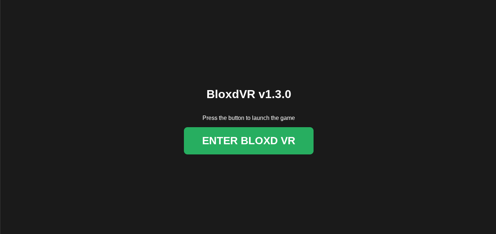

# 🎮 BloxdVR

**BloxdVR** is a custom, community-driven virtual reality project that brings the world of [Bloxd.io](https://bloxd.io) into a fully immersive VR experience. This project serves as a VR client and toolkit, enabling head tracking, VR controls, and a true 3D camera view for Bloxd players.

> **⚠️ Disclaimer:** BloxdVR is an **unofficial** third-party project and is not affiliated with the official Bloxd.io developers. It is part of the custom development ecosystem including **IQBloxd**, **VBloxd**, and **VRBloxd**.

## ✨ Features
*   **Head Movement Tracking:** Full 360-degree vision using the [WebXR Device API](https://developer.mozilla.org).
*   **VR Controls:** Optimized input mapping for Quest, Index, and major VR controllers.
*   **3D Camera View:** Enhanced depth perception for a true voxel immersion.
*   **VR Interactions:** Custom-coded mechanics designed for a VR sandbox environment.

## 🛠️ Getting Started

### Prerequisites
To use BloxdVR, you will need:
*   A VR-capable browser (Meta Quest Browser, Chrome, or Edge).
*   A compatible headset (Quest 2/3/Pro, Valve Index, Rift, etc.).
*   Optional: [Immersive Web Emulator](https://chromewebstore.google.com) for desktop testing.

### Installation / Usage
1. **Clone the repository:**
   ```bash
   gh repo clone isiguzoflorence521-gif/BloxdVR
Use the code with caution.

### 2. Open the project:
Open the index.html file through a local server (like Live Server for VS Code) or deploy via GitHub Pages.
🧪 Project Status: Sandbox
BloxdVR is currently a prototype. It serves as a testing ground for:
VR-to-Web integration.
Voxel-based movement physics.
Integration into the wider Bloxd toolkit ecosystem.


### 🤝 Contributing
Fork the Project.
Create your Feature Branch (git checkout -b feature/NewVRFeature).
Commit your changes (git commit -m 'Add VR teleportation').
Push to the Branch (git push origin feature/NewVRFeature).
Open a Pull Request.

### 👤 Supported VR Avatars (v1.3.0)


| Name    | Body Part | Appearance                                | Gender | Status |
| :------ | :-------- | :---------------------------------------- | :----- | :----- |
| **Bob**    | Head      | Default, Brown Hair, Blue Eyes            | Male   | ✅ Live |
| **Leo**    | Head      | Bright Skin, Brown Hair, Blue Eyes        | Male   | ✅ Live |
| **Sanjay** | Head      | Dark Skin, Short Hair, Light Brown Eyes   | Male   | ✅ Live |
| **Enoch**  | Head      | Dark Skin, Short Hair, Brown Eyes         | Male   | ✅ Live |
| **Emma**   | Head      | Bright Skin, Blond Hair, Green Eyes       | Female | 🔨 Dev  |
| **Isabel** | Head      | Bright Skin, Brown Hair, Blue Eyes        | Female | 📅 Plan |
| **Imara**  | Head      | Dark Skin, Long Hair, Brown Eyes          | Female | 📅 Plan |
| **Sara**   | Head      | Dark Skin, Long Hair, Dark Brown Eyes     | Female | 📅 Plan |

### 👕 VR-Synced Clothing (World Presence)
The BloxdVR engine (v1.3.0) now dynamically maps your avatar's clothing to your VR hand/arm meshes:

*   **Hoodie:** Red texture, default full-length sleeves, brown belt.
*   **Purple Top:** Purple texture, short sleeves, brown belt.
*   **Light Blue Polo:** Blue texture, short sleeves, black belt.
*   **Green Top:** Green texture, rolled-up sleeve meshes.
*   **Khakis:** Brown-ish texture with small pocket, brown belt.
*   **Light Blue Crop Top:** Light blue texture, sleeveless/crop style.

### 👖 Lower Body Sync
*   **Jeans/Trousers:** Light Blue, Navy Blue, or Brown long-sleeve leg meshes.
*   **Shorts:** Tan or Navy Blue Denim short-sleeve leg meshes with synced footwear.


### 📜 License
This project is licensed under the MIT License.
